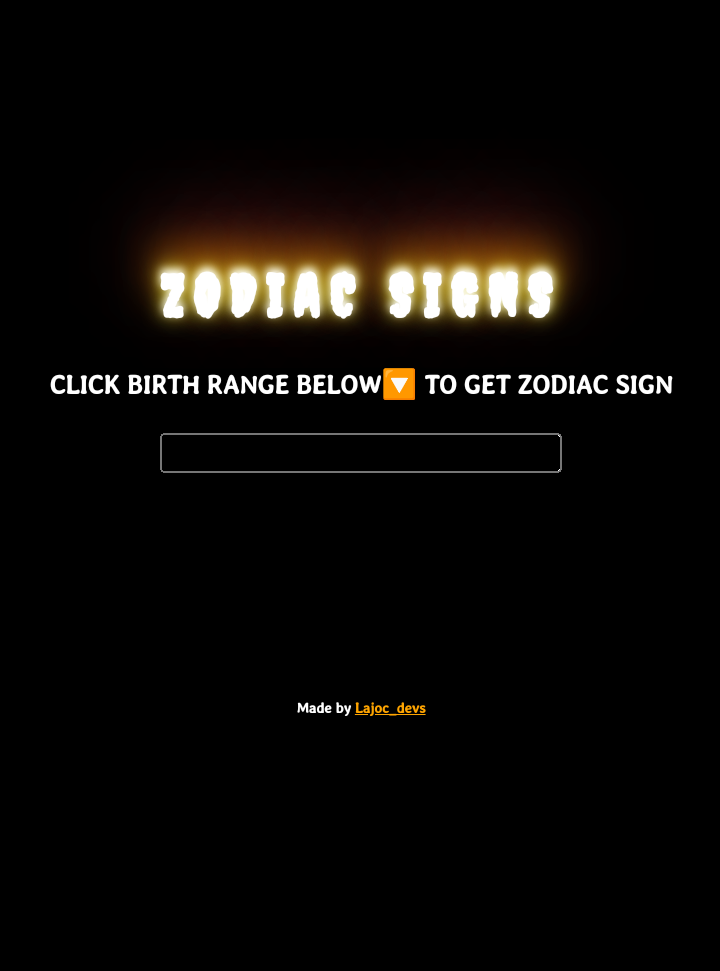
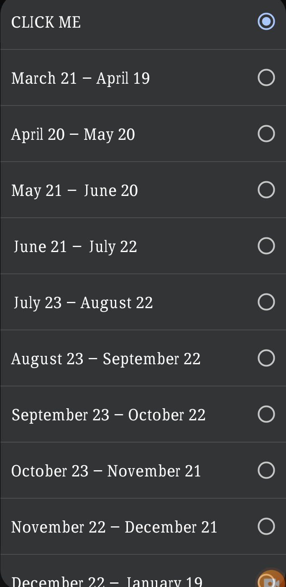
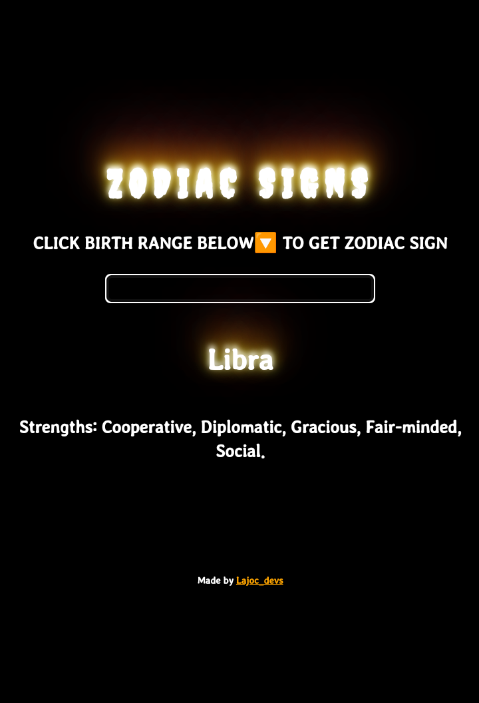

# Zodiac-sign

Zodiac sign built with html select option, css and JavaScript.
Testing out knowledge of JavaScript by building zodiac sign generator based on user selected option.

## Table of contents

- [Overview](#overview)

  - [The challenge](#the-challenge)

  - [Screenshot](#screenshot)

  - [Links](#links)

- [My process](#my-process)

  - [Built with](#built-with)

  - [What I learned and used](#what-i-learned-and-used)

  - [Continued development](#continued-development)

  - [Useful resources](#useful-resources)

- [Author](#author)

- [Acknowledgments](#acknowledgments)

## Overview

### The challenge

Users should be able to:

- Get a message about their zodiac sign just from selecting the range their birth date falls in.

### Screenshot

### Links

- Solution URL: [https://github.com/f-lajoc/Zodiac-sign] 

- Live Site URL: [https://f-lajoc.github.io/Zodiac-sign/]

## My process

### Built with

- Semantic HTML5 markup

- HTML select option 

- JavaScript

### What I learned and used

From the knowledge I've gained over a week now, i used some JavaScript I've learnt like

- variable declaration

- function

- if else conditional statement

- fetching DOM

### Continued development

I would love to have used array buh i haven't grasped it yet

Start using 'picture element'(srcset) for Responsiveness in my coming projects

### Useful resources

- [https://css-tricks.com]

- [https://www.google.com]- Random search when I thought of how i want the page to look like

- [https://w3schools.com]

## Author

- Twitter - [@lajoc__](https://www.twitter.com/lajoc__)

- Instagram - [@lajoc_devs](https://www.instagram.com/lajoc_devs)

- Codepen - [@lajoc__](https://codepen.io/lajoc__/pen/bGvYWjR)

## Acknowledgments

- Cereal, my accountability partner

- [https://github.com/SHAKUURR] - His [https://shakuurr.github.io/loveGuide/] inspired me to build this
